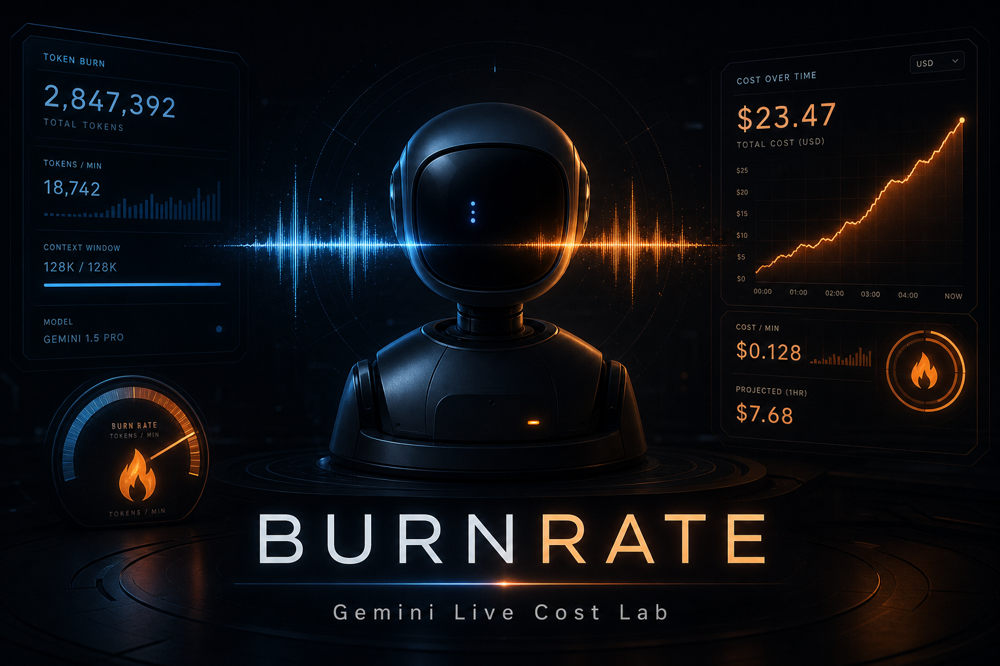
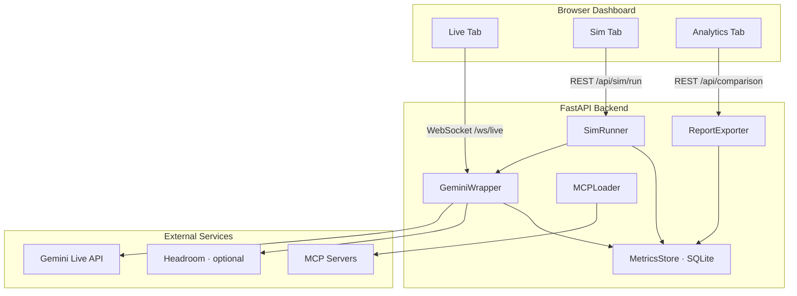

<p align="center">
  
</p>

<h1 align="center">Burnrate</h1>

<p align="center">
  <strong>Gemini Live cost lab for voice AI robots.</strong>
</p>

<p align="center">
  <a href="#quick-start">Quick Start</a> ·
  <a href="#architecture">Architecture</a> ·
  <a href="#api-reference">API</a> ·
  <a href="#scenario-format">Scenarios</a>
</p>

Burnrate measures real token economics for speech-to-speech agents — live mic sessions, fast-forward scenario sims, and side-by-side cost analytics. Built to answer one question with data: *what does one robot cost per hour, day, and month?*

Developed for Machani Robotics **CC**, a desktop robot powered by Gemini Live. Works for any Gemini Live + MCP + headroom setup.

---

## Why Burnrate?

Pricing a voice robot from API list rates alone is misleading. Actual cost depends on:

- **Audio I/O** — dominant; billed by the minute, not tokens
- **System prompt** — fixed per session
- **MCP tool definitions** — scales with connected servers
- **Conversation context** — grows over time; compressible with [headroom-ai](https://pypi.org/project/headroom-ai/)

Burnrate runs the same conversation under four configurations and extrapolates to fleet-scale numbers — session → daily → monthly → *N* robots.

---

## Features

| Mode | What it does |
|------|----------------|
| **Live** | Browser mic → PCM → Gemini Live → speaker. Per-turn token feed and running cost. |
| **Sim** | Replay YAML scenario scripts at full API speed. Extrapolate audio cost from turn duration. |
| **Analytics** | Comparison matrix across tools/headroom configs. Daily, monthly, and fleet projections. |

**Benchmark matrix** — four configs × multiple durations:

| Config | MCP Tools | Headroom |
|--------|-----------|----------|
| Baseline | off | off |
| Tools only | on | off |
| Headroom only | off | on |
| Full stack | on | on |

---

## Architecture



Every session is stored as **sessions + turns** in SQLite. Each turn captures `usageMetadata` from Gemini and maps it into four cost buckets.

---

## Cost buckets

| Bucket | Pricing | Notes |
|--------|---------|-------|
| Audio input | $0.005 / min | Dominant at scale |
| Audio output | $0.018 / min | Dominant at scale |
| Text input | $0.75 / 1M tokens | System prompt, tools, context |
| Text output | $4.50 / 1M tokens | Responses, tool calls |

Rates are configurable in `mcp.toml` — update when Gemini pricing changes.

---

## Quick start

### Prerequisites

- Python 3.11+
- A Gemini API key with Live API access
- *(Optional)* MCP servers and `headroom` for full benchmark matrix

### Install

```bash
git clone https://github.com/kavinbm16/Token-usage burnrate
cd burnrate
python -m venv .venv
source .venv/bin/activate   # Windows: .venv\Scripts\activate
pip install -r requirements.txt
```

### Configure

Create `.env` with your API key (never commit this file):

```bash
GEMINI_API=your_api_key_here
```

Edit `mcp.toml` for model, pricing, and optional MCP servers:

```toml
[gemini]
model = "gemini-3.1-flash-live-preview"

[pricing]
audio_input_per_min   = 0.005
audio_output_per_min  = 0.018
text_input_per_mtok   = 0.75
text_output_per_mtok  = 4.50

# [mcp_servers.filesystem]
# type    = "stdio"
# command = "npx"
# args    = ["-y", "@modelcontextprotocol/server-filesystem", "/tmp"]
```

### Build the dashboard

```bash
cd frontend
npm install
npm run build   # outputs to frontend/dist, served by FastAPI
cd ..
```

### Run

```bash
# Use --loop asyncio if you see DNS errors (nodename nor servname) connecting to Gemini
uvicorn backend.main:app --reload --port 8000 --loop asyncio
```

Preflight check:

```bash
curl http://localhost:8000/api/health/gemini | python -m json.tool
```

Open [http://localhost:8000](http://localhost:8000) for the dashboard.

For frontend development with hot reload, run the Vite dev server alongside uvicorn (it proxies `/api` and `/ws` to :8000):

```bash
cd frontend && npm run dev   # http://localhost:5173
```

### First sim run (API)

```bash
curl -X POST http://localhost:8000/api/sim/run \
  -H 'Content-Type: application/json' \
  -d '{
    "scenario_path": "scenarios/typical_workday.yaml",
    "tools_enabled": false,
    "headroom_enabled": false
  }'
```

Poll until complete:

```bash
curl http://localhost:8000/api/sim/status/<run_id>
```

View results:

```bash
curl http://localhost:8000/api/comparison | python -m json.tool
```

---

## Scenario format

Scenarios live in `scenarios/*.yaml`. Sim mode replays turns against Gemini and extrapolates audio cost from `avg_turn_duration_sec`.

```yaml
name: typical_workday
description: "Simulates a typical 30-minute robot interaction"
avg_turn_duration_sec: 25
system_prompt: "You are CC, a helpful desktop robot assistant."
turns:
  - "Good morning! What's the weather like today?"
  - "Set a reminder for my 3pm meeting."
  # ...
repeat: 16   # multiply turns to target duration (e.g. 8-hour workday)
```

---

## API reference

| Method | Path | Description |
|--------|------|-------------|
| `GET` | `/` | Dashboard UI |
| `GET` | `/api/sessions` | List all benchmark sessions |
| `GET` | `/api/sessions/{id}/turns` | Turn-level token breakdown |
| `GET` | `/api/comparison` | Comparison matrix for analytics |
| `GET` | `/api/config` | Model, pricing, and MCP server info |
| `GET` | `/api/scenarios` | Available scenario files with metadata |
| `GET` | `/api/sessions/{id}/projection` | Daily/monthly/fleet cost extrapolation (`hours_per_day`, `robots`) |
| `DELETE` | `/api/sessions/{id}` | Delete a session and its turns |
| `POST` | `/api/sim/run` | Start a scenario sim (`scenario_path`, `tools_enabled`, `headroom_enabled`) |
| `GET` | `/api/sim/status/{run_id}` | Sim progress and result |
| `GET` | `/api/export/csv` | Download sessions as CSV |
| `GET` | `/api/export/json` | Full session + turn JSON |
| `WS` | `/ws/live` | Live audio session (send init JSON, then PCM16 chunks) |

**Live WebSocket init message:**

```json
{ "tools_enabled": false, "headroom_enabled": false }
```

Server sends `session_started`, streaming `metrics` events, and PCM audio bytes.

---

## Project layout

```
burnrate/
├── .env                      # GEMINI_API key (not committed)
├── mcp.toml                  # Model, pricing, MCP server configs
├── scenarios/
│   └── typical_workday.yaml  # Example benchmark script
├── backend/
│   ├── main.py               # FastAPI app — REST, WebSocket, static UI
│   ├── config.py             # TOML loader
│   ├── gemini_wrapper.py     # Gemini Live SDK + usageMetadata capture
│   ├── mcp_loader.py           # MCP stdio/http → Gemini tool definitions
│   ├── sim_runner.py         # YAML scenario replay engine
│   ├── cost_calculator.py    # Per-turn and extrapolated pricing
│   ├── metrics_store.py      # SQLite sessions + turns
│   └── report_exporter.py    # CSV, JSON, comparison matrix
├── frontend/                 # Svelte 5 dashboard (Live · Sim · Analytics)
│   ├── src/App.svelte        # Shell: sidebar + tabs
│   ├── src/lib/api.ts        # Typed REST client
│   ├── src/lib/ws.ts         # Live WebSocket client
│   ├── src/lib/audio/        # AudioWorklet mic capture + PCM playback
│   └── src/lib/views/        # LiveView · SimView · AnalyticsView
└── tests/
```

---

## Exports

**CSV** — one row per session; columns include `tools_enabled`, `headroom_enabled`, `duration_seconds`, `total_cost_usd`. Drop into a pricing spreadsheet.

**JSON** — full session records with per-turn token breakdowns for archival or downstream tooling.

---

## Development

```bash
pytest tests/ -v
```

---

## Tech stack

| Layer | Choice |
|-------|--------|
| Backend | Python 3.11+, FastAPI, uvicorn |
| AI | `google-genai` — Gemini Live API |
| Context | `headroom-ai` — optional message compression |
| Tools | `mcp` — Model Context Protocol servers |
| Storage | SQLite via `aiosqlite` |
| Frontend | Svelte 5 + Vite + Tailwind v4 + shadcn-svelte + LayerChart |

---

## License

Internal — Machani Robotics. Contact the team before external distribution.
